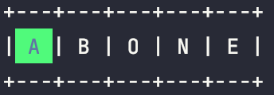
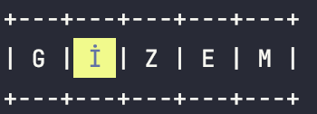
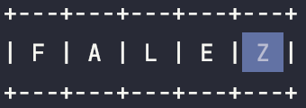

# Wordle-Clone

# _**How To Play**_

WORDLE'i 6 denemede bulun.

Her tahmin 5 harfli doğru bir kelime olmalıdır. Göndermek için enter'a basın.

Her tahminden sonra kutucukların renkleri tahmininizin yakınlığına göre değişecektir.

### **Örnekler**

#### _A harfi kelimede var ve doğru yerde._

**_İ harfi kelimede var fakat yanlış yerde._**

 _**Z harfi kelimede yok.**_

## **Her gün yeni bir WORDLE gelir!**